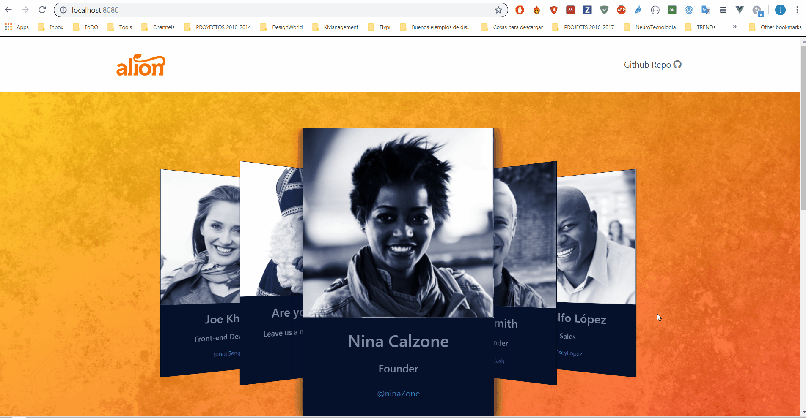

# Alion application demo



A vuejs demo website presenting an employee carousel, and a contact form.

> For details on the development process see the [todo](todo.md) list.

## Project setup

```
yarn install
```

### Compiles and hot-reloads for development

```
yarn run serve
```

> To test the swipe functionality in the smartphone us the following port:

```
Network: http://192.168.1.101:8080/
```

### Compiles and minifies for production

```
yarn run build
```

## How it was done

I basically developed a component per day, and then integrated them. The focus in the first 2 days was on functionality, properly connecting vue components and getting the logic to work(form validation, child-parent component communication, etc).

The second iteration focused on styling, refactoring code, checking responsiveness and also adding a navbar to make the app look like a website.
